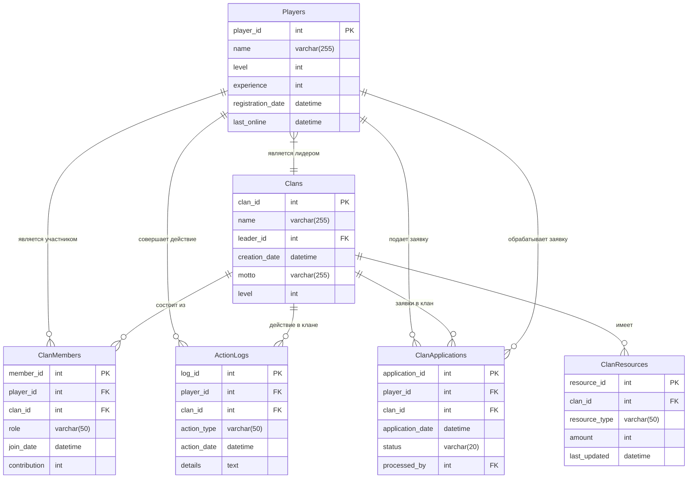
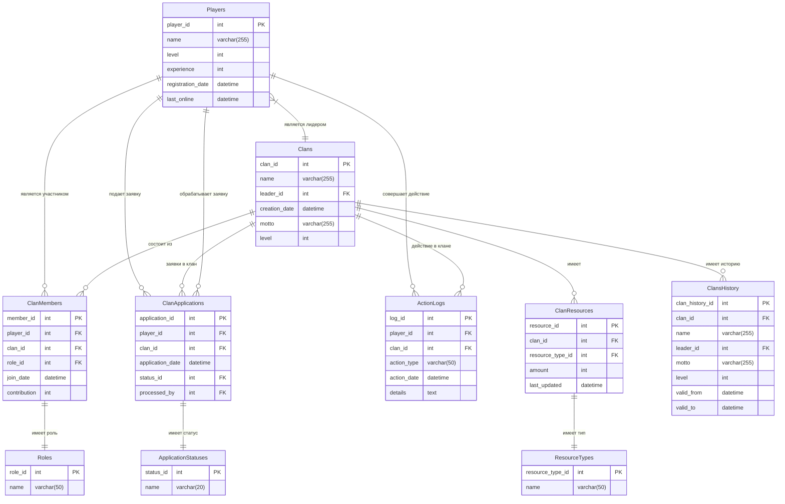

# База данных для управления игровыми кланами

# Описание структуры базы данных

## Таблицы базы данных

### 1. Игроки (Players)
Содержит информацию о игроках:
- `player_id` (PK) - уникальный идентификатор игрока
- `name` - имя игрока
- `level` - текущий уровень
- `experience` - количество опыта
- `registration_date` - дата регистрации
- `last_online` - дата последнего входа

### 2. Кланы (Clans)
Содержит информацию о кланах:
- `clan_id` (PK) - уникальный идентификатор клана
- `name` - название клана
- `leader_id` (FK -> Players) - ID лидера клана
- `creation_date` - дата создания
- `motto` - девиз клана
- `level` - уровень клана

### 3. Ресурсы клана (ClanResources)
Содержит информацию о ресурсах кланов:
- `resource_id` (PK) - уникальный идентификатор записи
- `clan_id` (FK -> Clans) - ID клана
- `resource_type` - тип ресурса (золото, древесина и т.д.)
- `amount` - количество ресурсов
- `last_updated` - дата последнего обновления

### 4. Состав клана (ClanMembers)
Содержит информацию о членах клана:
- `member_id` (PK) - уникальный идентификатор членства
- `player_id` (FK -> Players) - ID игрока
- `clan_id` (FK -> Clans) - ID клана
- `role` - роль в клане (новичок, офицер и т.д.)
- `join_date` - дата вступления
- `contribution` - вклад в клан

### 5. Логи действий (ActionLogs)
Содержит логи действий игроков:
- `log_id` (PK) - уникальный идентификатор записи
- `player_id` (FK -> Players) - ID игрока
- `clan_id` (FK -> Clans) - ID клана (может быть NULL)
- `action_type` - тип действия
- `action_date` - дата действия
- `details` - дополнительные детали

### 6. Заявки в клан (ClanApplications)
Содержит информацию о заявках в кланы:
- `application_id` (PK) - уникальный идентификатор заявки
- `player_id` (FK -> Players) - ID игрока
- `clan_id` (FK -> Clans) - ID клана
- `application_date` - дата подачи заявки
- `status` - статус заявки (рассматривается, принята, отклонена)
- `processed_by` (FK -> Players) - кто обработал заявку
-----------------------------------------------------------------------------
## 1. Концептуальная модель

## 2. Логическая модель

## 3. Физическая модель

### 3.1. Полная схема таблиц

| Таблица             | Поле                | Тип данных         | Ограничения                           | Описание                          |
|---------------------|---------------------|--------------------|---------------------------------------|-----------------------------------|
| **Players**         | `player_id`         | SERIAL             | PRIMARY KEY                          | Уникальный ID игрока              |
|                     | `name`              | VARCHAR(64)        | NOT NULL                             | Имя игрока                       |
|                     | `level`             | INTEGER            | DEFAULT 1, CHECK (1-100)             | Текущий уровень                  |
|                     | `experience`        | BIGINT             | DEFAULT 0                            | Количество опыта                 |
|                     | `registration_date` | TIMESTAMP          | DEFAULT CURRENT_TIMESTAMP            | Дата регистрации                 |
|                     | `last_online`       | TIMESTAMP          | DEFAULT CURRENT_TIMESTAMP            | Последний вход в игру            |
| **Clans**           | `clan_id`           | SERIAL             | PRIMARY KEY                          | Уникальный ID клана              |
|                     | `name`              | VARCHAR(64)        | NOT NULL, UNIQUE                     | Название клана                   |
|                     | `leader_id`         | INTEGER            | FK → Players(player_id)              | ID лидера                        |
|                     | `creation_date`     | TIMESTAMP          | DEFAULT CURRENT_TIMESTAMP            | Дата создания                    |
|                     | `motto`             | TEXT               |                                       | Девиз клана                      |
|                     | `level`             | INTEGER            | DEFAULT 1, CHECK (1-50)              | Уровень клана                    |
| **ClanResources**   | `resource_id`       | SERIAL             | PRIMARY KEY                          | Уникальный ID ресурса            |
|                     | `clan_id`           | INTEGER            | FK → Clans(clan_id) ON DELETE CASCADE | Ссылка на клан                   |
|                     | `resource_type`     | VARCHAR(32)        | NOT NULL                             | Тип ресурса                      |
|                     | `amount`            | BIGINT             | DEFAULT 0, CHECK (>=0)               | Количество ресурсов              |
|                     | `last_updated`      | TIMESTAMP          | DEFAULT CURRENT_TIMESTAMP            | Дата обновления                  |
| **ClanMembers**     | `member_id`         | SERIAL             | PRIMARY KEY                          | Уникальный ID членства           |
|                     | `player_id`         | INTEGER            | FK → Players(player_id) ON DELETE CASCADE | Ссылка на игрока                |
|                     | `clan_id`           | INTEGER            | FK → Clans(clan_id) ON DELETE CASCADE | Ссылка на клан                   |
|                     | `role`              | VARCHAR(32)        | DEFAULT 'новичок'                    | Роль в клане                     |
|                     | `join_date`         | TIMESTAMP          | DEFAULT CURRENT_TIMESTAMP            | Дата вступления                  |
|                     | `contribution`      | BIGINT             | DEFAULT 0                            | Вклад в развитие клана           |
| **ActionLogs**      | `log_id`            | SERIAL             | PRIMARY KEY                          | Уникальный ID записи лога        |
|                     | `player_id`         | INTEGER            | FK → Players(player_id)              | Ссылка на игрока                 |
|                     | `clan_id`           | INTEGER            | FK → Clans(clan_id) ON DELETE SET NULL | Ссылка на клан                  |
|                     | `action_type`       | VARCHAR(64)        | NOT NULL                             | Тип действия                     |
|                     | `action_date`       | TIMESTAMP          | DEFAULT CURRENT_TIMESTAMP            | Время действия                   |
|                     | `details`           | JSONB              |                                       | Дополнительные данные в JSON     |
| **ClanApplications**| `application_id`    | SERIAL             | PRIMARY KEY                          | Уникальный ID заявки             |
|                     | `player_id`         | INTEGER            | FK → Players(player_id)              | Игрок, подавший заявку           |
|                     | `clan_id`           | INTEGER            | FK → Clans(clan_id) ON DELETE CASCADE | Целевой клан                    |
|                     | `application_date`  | TIMESTAMP          | DEFAULT CURRENT_TIMESTAMP            | Дата подачи заявки               |
|                     | `status`            | VARCHAR(32)        | DEFAULT 'рассматривается'            | Статус заявки                    |
|                     | `processed_by`      | INTEGER            | FK → Players(player_id)              | Кто обработал заявку             |

### 3.3. Дополнительные ограничения

```sql
-- Одно членство в клане на игрока
ALTER TABLE ClanMembers ADD CONSTRAINT unique_player_in_clan 
UNIQUE (player_id, clan_id);

-- Один тип ресурса на клан
ALTER TABLE ClanResources ADD CONSTRAINT unique_resource_per_clan 
UNIQUE (clan_id, resource_type);

-- Одна активная заявка от игрока в клан
ALTER TABLE ClanApplications ADD CONSTRAINT unique_pending_application 
UNIQUE (player_id, clan_id) WHERE status = 'рассматривается';
```
# 🎮 Скрипты для управления игровыми кланами

## 📌 Содержание
- [Управление игроками](#-управление-игроками)
- [Управление кланами](#-управление-кланами)
- [Управление ресурсами](#-управление-ресурсами)
- [Управление участниками](#-управление-участниками)
- [Логирование действий](#-логирование-действий)
- [Администрирование](#-администрирование)

## 👤 Управление игроками

### Добавление нового игрока
```sql
INSERT INTO Players (name, level, experience)
VALUES (:name, :level, :exp)
RETURNING player_id;
```
